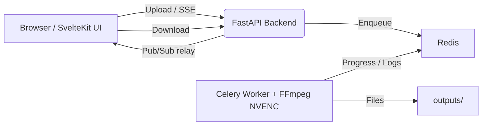

# 8mb.local – Self‑Hosted GPU Video Compressor

8mb.local is a self‑hosted, fire‑and‑forget video compressor. Drop a file, choose a target size (e.g., 8MB, 25MB, 50MB, 100MB), and let GPU-accelerated encoding produce compact outputs with AV1/HEVC/H.264. Supports **NVIDIA NVENC**, **Intel/AMD VAAPI** (Linux), and **CPU fallback**. The stack includes a SvelteKit UI, FastAPI backend, Celery worker, Redis broker, and real‑time progress via Server‑Sent Events (SSE).

> **Note**: Windows-only encoders (AMD AMF) have been removed as they don't work in Docker's Linux environment. AMD GPUs use VAAPI on Linux.
>
> **Note**: Intel QSV via libmfx is not compiled into this image to keep builds reliable; Intel GPUs are supported via VAAPI on Linux.

## Screenshots

<details>
<summary>Screenshots (click to expand)</summary>

<br/>


</details>

## Features
- **Multi-vendor GPU support**: Auto-detects NVIDIA NVENC, Intel/AMD VAAPI (Linux), or falls back to CPU
- **Robust encoder validation**: Tests actual encoder initialization, not just availability listing
- **Automatic CPU fallback**: Gracefully handles missing drivers, permission issues, or hardware access problems
- Drag‑and‑drop UI with helpful presets and advanced options (codec, container, tune, audio bitrate)
- **Configurable codec visibility**: Enable/disable specific codecs in Settings page
- **Resolution control**: Set max width/height while maintaining aspect ratio
- **Video trimming**: Specify start/end times (seconds or HH:MM:SS format)
- ffprobe analysis on upload for instant estimates and warnings
- **Real‑time progress tracking**: Live encoding progress via Server-Sent Events (SSE) on both main and queue pages
- **Real‑time FFmpeg logs**: Streaming logs during compression for instant feedback
- **One‑click Cancel**: Stop an in‑flight encode; worker interrupts FFmpeg immediately
- **Automatic file size optimization**: If output exceeds target by >2%, automatically re-encodes with adjusted bitrate
- **Smart retry notifications**: Audio alerts and visual notifications when auto-retry occurs
- **History tracking enabled by default**: Recent jobs stored in `/app/history.json`
- **Auto‑download enabled by default**
- Hardware encoders: AV1, HEVC (H.265), H.264 (GPU-accelerated when available)
- Software fallback: libx264, libx265, libaom-av1 for CPU-only systems
- Output container choice: MP4 or MKV, with compatibility safeguards

## Architecture (technical deep dive)



Components
- Frontend (SvelteKit + Vite): drag‑and‑drop UI, size estimates, SSE progress/logs, final download.
- Backend API (FastAPI): accepts uploads, runs ffprobe, relays SSE, and serves downloads.
- Worker (Celery + FFmpeg 6.1.1): executes compression with auto-detected hardware acceleration (NVENC/VAAPI/CPU); parses `ffmpeg -progress` and publishes updates.
- Redis (broker + pub/sub): Celery broker and transport for progress/log events.

Data & files
- `uploads/` – incoming files
- `outputs/` – compressed results
- The backend periodically deletes old files after `FILE_RETENTION_HOURS`.

## Configuration

### Environment Variables
 - `WORKER_CONCURRENCY` - Maximum concurrent compression jobs (default: 4, range: 1-20)
- `BACKEND_HOST` - Backend bind address (default: 0.0.0.0)
- `BACKEND_PORT` - Backend port (default: 8001)
- `PUBLIC_BACKEND_URL` - Frontend API endpoint; leave unset to use same‑origin (recommended)

### Codec Visibility Settings
Control which codecs appear in the UI via environment variables or the Settings page:
- `CODEC_H264_NVENC`, `CODEC_HEVC_NVENC`, `CODEC_AV1_NVENC` - NVIDIA encoders
- `CODEC_H264_QSV`, `CODEC_HEVC_QSV`, `CODEC_AV1_QSV` - Intel Quick Sync
- `CODEC_H264_VAAPI`, `CODEC_HEVC_VAAPI`, `CODEC_AV1_VAAPI` - AMD/Intel VAAPI (Linux)
- `CODEC_LIBX264`, `CODEC_LIBX265`, `CODEC_LIBAOM_AV1` - CPU encoders

All default to `true`. The system validates encoder availability at runtime and automatically falls back to CPU if hardware isn't available.

### Settings UI
You can manage settings through the web interface at `/settings`:
- **Authentication**: Enable/disable auth, add/change users, change passwords
- **Default Presets**: Set default target size, codec, quality, container, etc.
- **Codec Visibility**: Enable/disable specific codecs (NVIDIA/Intel/AMD/CPU)
- **GPU Support Reference**: View GPU hardware encoding compatibility at `/gpu-support`
- No container restart required - changes take effect immediately

Example `.env` file:

```env
AUTH_ENABLED=false
AUTH_USER=admin
AUTH_PASS=changeme
FILE_RETENTION_HOURS=1
WORKER_CONCURRENCY=4
REDIS_URL=redis://127.0.0.1:6379/0
BACKEND_HOST=0.0.0.0
BACKEND_PORT=8001
```

## Using the app
1. Drag & drop a video or Choose File.
2. Pick a target size or enter a custom MB value, click Analyze (auto‑analyzes on drop).

## Performance & Concurrency

### Multiple Simultaneous Jobs
8mb.local supports running multiple compression jobs in parallel. Configure the maximum number of concurrent jobs via:
- **Settings UI**: Navigate to Settings → Worker Concurrency
- **Environment Variable**: Set `WORKER_CONCURRENCY` in your `.env` file (default: 4)
- **Docker Compose**: Add `WORKER_CONCURRENCY=10` to environment section

**Important**: Container restart required after changing concurrency setting.

### Hardware-Specific Recommendations

| GPU Model | Recommended Concurrency | Notes |
|-----------|------------------------|-------|
| **Quadro RTX 4000 / RTX 3060+** | 6-10 jobs | Excellent NVENC throughput, handles high concurrency well |
| **RTX 3090 / 4090** | 8-12 jobs | Top-tier NVENC performance, best for bulk processing |
| **GTX 1660 / RTX 2060** | 3-5 jobs | Good NVENC performance for mid-range |
| **GTX 1050 Ti / Entry-level** | 2-3 jobs | Basic NVENC, limited parallel capacity |
| **CPU-only (libx264/libx265)** | 1-2 jobs per 4 cores | Very slow, high CPU usage |
| **Intel/AMD VAAPI** | 4-8 jobs | Depends on iGPU/dGPU capabilities |

### Performance Considerations
- **NVENC Sessions**: Most NVIDIA GPUs support 2-3 native NVENC sessions, but driver patches/Pro GPUs allow unlimited
- **Memory Usage**: Each job uses ~200-500MB RAM; monitor total system memory
- **GPU Memory**: Each NVENC encode uses ~100-200MB VRAM
- **Disk I/O**: Higher concurrency increases disk load; SSD recommended for 6+ concurrent jobs
- **Thermal Throttling**: Monitor GPU temps with high concurrency (>80°C may cause slowdowns)

### Queue Visualization
The Queue page clearly shows which jobs are running simultaneously:
- **Running jobs**: Blue pulsing lightning bolt (⚡), blue border, "RUNNING NOW" indicator
- **Queued jobs**: Yellow "Waiting in queue" status
- **Live progress**: Real-time progress updates for all running jobs

Start with 4 concurrent jobs and gradually increase while monitoring GPU utilization and job completion times.

## Using the app
1. Drag & drop a video or Choose File.
2. Pick a target size or enter a custom MB value, click Analyze (auto‑analyzes on drop).
3. Optional: open Advanced Options.
   - Video Codec: AV1 (best quality on newer RTX), HEVC (H.265), or H.264 (compatibility).
   - Audio Codec: Opus (default) or AAC. MP4 will auto‑fallback to AAC when Opus is chosen.
   - Speed/Quality: NVENC P1 (fast) … P7 (best). Default P6.
   - Container: MP4 (most compatible) or MKV (best with Opus).
   - Tune: Best Quality (HQ), Low Latency, Ultra‑Low Latency, or Lossless.
4. Click Compress and watch progress/logs. Use Cancel to stop mid‑encode. Download starts automatically when done.

Codec/container notes
- MP4 + Opus isn’t widely supported. If MP4+Opus is selected, the worker automatically uses AAC to preserve compatibility. MKV supports Opus directly.
- MP4 outputs include `+faststart` for better web playback.
- H.264/HEVC outputs are set to a compatible pixel format (yuv420p) and profiles.

Performance tips
- For very small targets, prefer AV1/HEVC and keep audio around 96–128 kbps.
- If speed matters, try Low/Ultra‑Low latency tunes with a faster preset (P1–P4). For best quality, use HQ with P6/P7.

## GPU support tips

### Hardware Acceleration Support
8mb.local automatically detects and uses available hardware acceleration:

- **NVIDIA GPU (NVENC)**: Best support for AV1, HEVC, H.264
  - Requires RTX 40/50 series for AV1, GTX 10+ for HEVC/H.264
  - Windows: Docker Desktop + WSL2 with GPU enabled; install NVIDIA drivers and Container Toolkit in WSL2
  - Linux: Install NVIDIA drivers and NVIDIA Container Toolkit
  - Use `--gpus all` flag in docker run command
  - Check: `docker exec 8mblocal bash -c "ffmpeg -hide_banner -encoders | grep -i nvenc"`

- **Intel GPU (Quick Sync Video - QSV)**: Good support for H.264, HEVC, AV1 (Arc GPUs)
  - Requires Intel GPU with QSV support (most 6th gen+ Core CPUs and Arc GPUs)
  - Linux: Ensure `/dev/dri` is accessible in container
  - Use `--device=/dev/dri:/dev/dri` flag in docker run command
  - Check: `docker exec 8mblocal bash -c "ffmpeg -hide_banner -encoders | grep -i qsv"`

- **AMD GPU (VAAPI - Linux only)**: Support for H.264, HEVC, AV1
  - Linux: VAAPI (requires Mesa drivers and `/dev/dri` access)
  - Use `--device=/dev/dri:/dev/dri` flag in docker run command
  - AMD RDNA 2+ recommended for best compatibility
  - Check: `docker exec 8mblocal bash -c "ffmpeg -hide_banner -encoders | grep vaapi"`

- **CPU Fallback**: Works on any system without GPU
  - Uses libx264 (H.264), libx265 (HEVC), libaom-av1 (AV1)
  - Slower but universal compatibility
  - Automatically used if hardware encoder unavailable

The system validates encoder availability at runtime and automatically falls back to CPU if hardware isn't available. You'll see log messages like:
- "Using encoder: h264_vaapi (requested: h264_vaapi)" - Hardware working
- "Warning: h264_vaapi not available, falling back to CPU (libx264)" - CPU fallback
- "Warning: hevc_nvenc failed initialization test (driver/library issue), falling back to CPU" - Hardware listed but can't initialize

## Installation

### Quick Start with Docker

The easiest way to run 8mb.local is with the pre-built Docker image. Choose the command for your system:

#### CPU Only (No GPU)
```bash
docker run -d --name 8mblocal -p 8001:8001 -v ./uploads:/app/uploads -v ./outputs:/app/outputs jms1717/8mblocal:latest
```

#### NVIDIA GPU (NVENC)
```bash
docker run -d --name 8mblocal --gpus all -e NVIDIA_DRIVER_CAPABILITIES=compute,video,utility -p 8001:8001 -v ./uploads:/app/uploads -v ./outputs:/app/outputs jms1717/8mblocal:latest
```
> **Note**: The `-e NVIDIA_DRIVER_CAPABILITIES=compute,video,utility` environment variable is **required** to enable NVENC support. It tells the NVIDIA Container Toolkit to mount video encoding libraries into the container.

#### Intel/AMD GPU (VAAPI - Linux)
```bash
docker run -d --name 8mblocal --device=/dev/dri:/dev/dri -p 8001:8001 -v ./uploads:/app/uploads -v ./outputs:/app/outputs jms1717/8mblocal:latest
```

#### NVIDIA + VAAPI (Dual GPU - Linux)
```bash
docker run -d --name 8mblocal --gpus all -e NVIDIA_DRIVER_CAPABILITIES=compute,video,utility --device=/dev/dri:/dev/dri -p 8001:8001 -v ./uploads:/app/uploads -v ./outputs:/app/outputs jms1717/8mblocal:latest
```

Access the web UI at: **http://localhost:8001**

### Docker Compose

For easier management, use Docker Compose. Create a `docker-compose.yml` file:

#### CPU Only
```yaml
services:
  8mblocal:
    image: jms1717/8mblocal:latest
    container_name: 8mblocal
    ports:
      - "8001:8001"
    volumes:
      - ./uploads:/app/uploads
      - ./outputs:/app/outputs
      - ./.env:/app/.env  # Optional: for custom settings
    restart: unless-stopped
```

#### NVIDIA GPU
```yaml
services:
  8mblocal:
    image: jms1717/8mblocal:latest
    container_name: 8mblocal
    ports:
      - "8001:8001"
    volumes:
      - ./uploads:/app/uploads
      - ./outputs:/app/outputs
      - ./.env:/app/.env  # Optional: for custom settings
    restart: unless-stopped
    environment:
      - NVIDIA_DRIVER_CAPABILITIES=compute,video,utility  # Required for NVENC
    deploy:
      resources:
        reservations:
          devices:
            - driver: nvidia
              count: all
              capabilities: [gpu]
```

#### Intel/AMD VAAPI (Linux)
```yaml
services:
  8mblocal:
    image: jms1717/8mblocal:latest
    container_name: 8mblocal
    ports:
      - "8001:8001"
    volumes:
      - ./uploads:/app/uploads
      - ./outputs:/app/outputs
      - ./.env:/app/.env  # Optional: for custom settings
    devices:
      - /dev/dri:/dev/dri
    restart: unless-stopped
```

#### NVIDIA + VAAPI (Dual GPU)
```yaml
services:
  8mblocal:
    image: jms1717/8mblocal:latest
    container_name: 8mblocal
    ports:
      - "8001:8001"
    volumes:
      - ./uploads:/app/uploads
      - ./outputs:/app/outputs
      - ./.env:/app/.env  # Optional: for custom settings
    devices:
      - /dev/dri:/dev/dri
    restart: unless-stopped
    deploy:
      resources:
        reservations:
          devices:
            - driver: nvidia
              count: all
              capabilities: [gpu]
```

Then run:
```bash
docker compose up -d
```

### Building from Source

If you want to build the image yourself:

1. Clone the repository:
```bash
git clone https://github.com/JMS1717/8mb.local.git
cd 8mb.local
```

2. Build and run:
```bash
docker build -t 8mblocal:local .
docker run -d --name 8mblocal -p 8001:8001 -v ./uploads:/app/uploads -v ./outputs:/app/outputs 8mblocal:local
```

Or with Docker Compose:
```bash
docker compose up -d --build
```

### Configuration

Create a `.env` file in the same directory as your docker-compose.yml (optional):

```env
# Authentication (can also be configured via Settings UI)
AUTH_ENABLED=false
AUTH_USER=admin
AUTH_PASS=changeme

# File retention
FILE_RETENTION_HOURS=1

# Codec visibility (all default to true)
CODEC_H264_NVENC=true
CODEC_HEVC_NVENC=true
CODEC_AV1_NVENC=true
CODEC_H264_QSV=true
CODEC_HEVC_QSV=true
CODEC_AV1_QSV=true
CODEC_H264_VAAPI=true
CODEC_HEVC_VAAPI=true
CODEC_AV1_VAAPI=true
CODEC_LIBX264=true
CODEC_LIBX265=true
CODEC_LIBAOM_AV1=true

# Redis (internal, usually no need to change)
REDIS_URL=redis://127.0.0.0:6379/0
BACKEND_HOST=0.0.0.0
BACKEND_PORT=8001
```

Mount it with `-v ./.env:/app/.env` in docker run, or add it to volumes in docker-compose.yml.

### Reverse Proxy Configuration

**CRITICAL for Real-Time Progress**: If using a reverse proxy (nginx, Nginx Proxy Manager, Traefik, etc.), SSE (Server-Sent Events) requires special configuration to prevent buffering:

#### Nginx / Nginx Proxy Manager
Add to your proxy configuration for the `/api/stream/` location:

```nginx
location /api/stream/ {
    proxy_pass http://backend:8001;
    proxy_buffering off;              # REQUIRED - Disables response buffering for SSE
    proxy_cache off;                  # Recommended - Disables caching
    proxy_set_header Connection '';   # Recommended - Removes connection header
    chunked_transfer_encoding on;     # Recommended - Enables chunked transfer
}
```

**In Nginx Proxy Manager**: 
1. Edit your Proxy Host
2. Go to "Advanced" tab
3. Add to "Custom Nginx Configuration":
```nginx
location /api/stream/ {
    proxy_buffering off;
    proxy_cache off;
    proxy_set_header Connection '';
    chunked_transfer_encoding on;
}
```

#### Traefik
Add labels to your docker-compose:
```yaml
labels:
  - "traefik.http.middlewares.no-buffer.buffering.maxRequestBodyBytes=0"
  - "traefik.http.middlewares.no-buffer.buffering.maxResponseBodyBytes=0"
  - "traefik.http.routers.8mblocal.middlewares=no-buffer"
```

#### Apache
```apache
<Location /api/stream/>
    ProxyPass http://backend:8001/api/stream/
    ProxyPassReverse http://backend:8001/api/stream/
    SetEnv proxy-sendchunked 1
    SetEnv proxy-interim-response RFC
</Location>
```

**Why this matters**: Without `proxy_buffering off`, nginx buffers the entire SSE response and sends all progress events at once when the job completes, instead of streaming them in real-time. You'll see "progress stuck at 0%" until completion, then everything updates instantly.

**Testing**: After configuring, start a compression job. You should see:
- Progress bar updating smoothly in real-time
- FFmpeg logs appearing as encoding happens
- Browser console showing SSE events: `SSE connection opened`, `SSE event: progress`

If progress still doesn't update until completion, check your proxy logs and verify `proxy_buffering off;` is applied.

### Platform-Specific Setup

#### Windows
1. Install Docker Desktop
2. For NVIDIA GPU: Install NVIDIA drivers, enable WSL2 GPU support in Docker Desktop settings
3. Use the NVIDIA GPU docker command above
4. Note: AMD GPUs don't work in Docker on Windows (VAAPI is Linux-only)

#### Linux
1. Install Docker: `curl -fsSL https://get.docker.com | sh`
2. For NVIDIA: Install NVIDIA drivers and [NVIDIA Container Toolkit](https://docs.nvidia.com/datacenter/cloud-native/container-toolkit/install-guide.html)
3. For Intel/AMD: Ensure `/dev/dri` exists and user has access (`ls -l /dev/dri`)
4. Add your user to docker group: `sudo usermod -aG docker $USER` (logout/login required)
5. Use the appropriate docker command for your GPU

#### macOS
1. Install Docker Desktop
2. Note: No GPU acceleration available on macOS (Docker runs in Linux VM without GPU passthrough)
3. Use CPU-only docker command
4. Performance will be slower but functional

### Verify Installation

1. Check container is running:
```bash
docker ps | grep 8mblocal
```

2. Check available encoders:
```bash
docker exec 8mblocal bash -c "ffmpeg -hide_banner -encoders | grep -E 'nvenc|qsv|vaapi|264|265|av1'"
```

3. View logs:
```bash
docker logs 8mblocal
```

Access the UI at **http://localhost:8001** and go to **Settings → Available Codecs** to see detected hardware.

### Update to Latest Version

Pull the latest image and restart:
```bash
docker pull jms1717/8mblocal:latest
docker stop 8mblocal
docker rm 8mblocal
# Then run your docker run command again, or:
docker compose pull
docker compose up -d
```

### Troubleshooting

#### Hardware Acceleration Issues
- **NVENC "Operation not permitted" or "Driver does not support required nvenc API version" error**: 
  - **Most common cause**: Missing `NVIDIA_DRIVER_CAPABILITIES` environment variable
  - **Solution**: Add `-e NVIDIA_DRIVER_CAPABILITIES=compute,video,utility` to your docker run command
  - Example:
    ```bash
    docker run -d --name 8mblocal \
      --gpus all \
      -e NVIDIA_DRIVER_CAPABILITIES=compute,video,utility \
      -p 8001:8001 \
      -v ./uploads:/app/uploads \
      -v ./outputs:/app/outputs \
      jms1717/8mblocal:latest
    ```
  - This tells the NVIDIA Container Toolkit to mount NVENC libraries into the container
  
  - **Critical: Driver Version Mismatch** - The #1 cause of NVENC failures:
    - **Error symptom**: `Driver does not support the required nvenc API version. Required: 13.0 Found: 12.1`
    - **Root cause**: Container ffmpeg requires NVENC API 13.0, but host driver only provides 12.1
    - **Who's affected**: Systems running NVIDIA driver 535.x (common on Debian 12 stable, older Ubuntu LTS)
    - **Quick check**: Run `nvidia-smi` and look at driver version:
      - Driver **535.x** = NVENC API 12.1 ❌ (too old)
      - Driver **550.x or newer** = NVENC API 13.0 ✅ (compatible)
    
  - **Solution: Upgrade NVIDIA Driver**
    
    For **Debian 12** systems:
    ```bash
    # Debian backports has older drivers - use NVIDIA's official repo instead
    wget https://developer.download.nvidia.com/compute/cuda/repos/debian12/x86_64/cuda-keyring_1.1-1_all.deb
    sudo dpkg -i cuda-keyring_1.1-1_all.deb
    sudo apt update
    sudo apt install nvidia-driver
    sudo reboot  # Required to load new driver
    ```
    
    For **Ubuntu** systems:
    ```bash
    # Add NVIDIA PPA for latest drivers
    sudo add-apt-repository ppa:graphics-drivers/ppa
    sudo apt update
    sudo apt install nvidia-driver-550  # or newer
    sudo reboot
    ```
    
    After reboot, verify: `nvidia-smi` should show driver 550+ and `ffmpeg -encoders | grep nvenc` inside container should work.
    
  - **Why this happens**: Newer ffmpeg builds use NVENC API 13.0 features for better quality/performance. Older drivers (535.x) only support up to API 12.1.
  
  - **Verification steps**:
    1. Check host driver: `nvidia-smi` (look for version 550+)
    2. Test NVENC in container: `docker exec 8mblocal ffmpeg -f lavfi -i nullsrc -c:v h264_nvenc -f null -`
    3. If you see "Cannot load libnvidia-encode.so.1", add the `NVIDIA_DRIVER_CAPABILITIES` env var above
    4. If you see "Required: 13.0 Found: 12.1", upgrade your driver
  
  - On Linux: Verify [NVIDIA Container Toolkit](https://docs.nvidia.com/datacenter/cloud-native/container-toolkit/install-guide.html) is installed
  - **If driver upgrade not possible**: System will automatically fallback to CPU encoding
  
- **Intel QSV not working**: 
  - Ensure `/dev/dri` exists: `ls -l /dev/dri`
  - Check device permissions: `groups` should show `video` or `render`
  - Verify `--device=/dev/dri:/dev/dri` flag is used
  - Install Intel GPU drivers if needed
  
- **AMD VAAPI issues**: 
  - Ensure Mesa drivers installed: `glxinfo | grep -i mesa` (install `mesa-utils`)
  - Check `/dev/dri` exists and is accessible
  - Verify `--device=/dev/dri:/dev/dri` flag is used
  - AMD RDNA 2+ recommended for best AV1 support
  - **VAAPI device errors** ("No VA display found"): System will automatically fall back to CPU

#### System automatically falls back to CPU
- This is expected behavior if hardware encoder isn't available
- Check Settings → Available Codecs to see what's enabled
- Look for log messages: "Warning: X not available, falling back to CPU (Y)"
- CPU encoding works but is slower - consider enabling fewer codecs or using faster presets

#### NVENC "Operation not permitted" Error
This error occurs when NVENC encoder fails to initialize. **The system now automatically detects this and falls back to CPU**, but if you want GPU acceleration:

**Error Messages You May See:**
1. **"Cannot load libnvidia-encode.so.1"**
   - **Cause**: Missing `NVIDIA_DRIVER_CAPABILITIES` environment variable
   - **Fix**: Add `-e NVIDIA_DRIVER_CAPABILITIES=compute,video,utility` to docker run command (see example in NVENC section above)
   - **Why**: By default, NVIDIA Container Toolkit only mounts compute libraries, not video encoding libraries

2. **"Driver does not support the required nvenc API version. Required: 13.0 Found: 12.1"**
   - **Cause**: Your NVIDIA driver is too old (535.x series only supports NVENC API 12.1)
   - **Fix**: Upgrade to driver 550+ using the instructions in the NVENC troubleshooting section above
   - **Common on**: Debian 12 stable, older Ubuntu LTS releases
   - **Verification**: Run `nvidia-smi` and check driver version

3. **"Could not open encoder before EOF" or "Task finished with error code: -22 (Invalid argument)"**
   - **Cause**: Usually accompanies one of the errors above
   - **Effect**: FFmpeg crashes with exit code 255
   - **Fix**: Resolve the underlying library or API version issue

**Common causes:**
1. **Driver API version mismatch** (most common - see error #2 above)
2. **Missing video encoding libraries** (see error #1 above)
3. **Missing NVIDIA Container Toolkit**: Docker can't access GPU
4. **Insufficient permissions**: Container can't access encoder

**Quick Fix (Automatic):**
The system will detect the initialization failure and automatically use CPU encoding. You'll see:
```
Warning: hevc_nvenc failed initialization test (driver/library issue), falling back to CPU
Using encoder: libx265 (requested: hevc_nvenc)
```
Your video will still compress, just using CPU instead of GPU.

**To Enable GPU (Optional):**
1. **Fix missing NVIDIA_DRIVER_CAPABILITIES** (if you saw error #1 above):
   - Add environment variable to docker run: `-e NVIDIA_DRIVER_CAPABILITIES=compute,video,utility`
   - Or in Docker Compose:
     ```yaml
     environment:
       - NVIDIA_DRIVER_CAPABILITIES=compute,video,utility
     ```

2. **Upgrade NVIDIA driver** (if you saw error #2 above):
   - See detailed upgrade instructions in the "NVENC issues" section above
   - Debian 12: Use NVIDIA's official CUDA repository (not backports)
   - Ubuntu: Use graphics-drivers PPA
   - Requires reboot after installation
   
3. **Missing NVIDIA Container Toolkit**: Docker can't access GPU
   - Install: `distribution=$(. /etc/os-release;echo $ID$VERSION_ID) && curl -fsSL https://nvidia.github.io/libnvidia-container/gpgkey | sudo gpg --dearmor -o /usr/share/keyrings/nvidia-container-toolkit-keyring.gpg && curl -s -L https://nvidia.github.io/libnvidia-container/$distribution/libnvidia-container.list | sed 's#deb https://#deb [signed-by=/usr/share/keyrings/nvidia-container-toolkit-keyring.gpg] https://#g' | sudo tee /etc/apt/sources.list.d/nvidia-container-toolkit.list && sudo apt-get update && sudo apt-get install -y nvidia-container-toolkit`
   - Restart Docker: `sudo systemctl restart docker`
   
4. **Workaround if upgrade not possible**: Disable NVENC and use CPU or VAAPI
   - Go to Settings → Available Codecs
   - Uncheck all NVENC codecs (H.264/HEVC/AV1)
   - Enable CPU codecs or VAAPI if you have Intel/AMD GPU
   - System will automatically use available encoders

**Real-World Example: Debian 12 with Driver 535**
On a fresh Debian 12 install with Quadro RTX 4000, the default driver (535.247.01) is too old:
```bash
# Initial state - fails with API 12.1 vs 13.0 error
nvidia-smi  # Shows driver 535.247.01

# Fix by upgrading to NVIDIA's official driver repository
wget https://developer.download.nvidia.com/compute/cuda/repos/debian12/x86_64/cuda-keyring_1.1-1_all.deb
sudo dpkg -i cuda-keyring_1.1-1_all.deb
sudo apt update
sudo apt install nvidia-driver  # Installs 550+ series
sudo reboot

# After reboot - NVENC works!
nvidia-smi  # Shows driver 580.95.05 or newer
```

This resolved the exact issue encountered on the powerhouse server.

#### General Issues
- **Permission denied writing uploads/outputs**: 
  - Ensure directories exist and have correct permissions
  - Try: `chmod 777 uploads outputs` or `chown -R $USER:$USER uploads outputs`
  
- **Ports in use**: 
  - Change port mapping: `-p 8080:8001` instead of `-p 8001:8001`
  - Usually no need to set `PUBLIC_BACKEND_URL` (frontend uses same‑origin)
  
- **Progress bar stuck at 0% until job completes**: 
  - **Cause**: Reverse proxy (nginx/NPM/Traefik) is buffering SSE responses
  - **Symptom**: All progress events arrive at once when encoding finishes
  - **Fix**: Add `proxy_buffering off;` to your proxy config for `/api/stream/` location (see Reverse Proxy Configuration section above)
  - **Test**: Check browser console for SSE events during encoding, not just at completion
  
- **Container won't start**:
  - Check logs: `docker logs 8mblocal`
  - Verify .env file syntax if using custom configuration
  - Try removing container and running again: `docker rm -f 8mblocal`
  
- **Files slightly over target size**:
  - **Expected behavior**: System automatically retries if >2% over target
  - You'll see a notification: "File exceeded target by X.X%, retrying with adjusted bitrate"
  - Sound alert plays when retry occurs
  - Check logs for "Retry attempt" messages
  
- **FFmpeg errors**:
  - Full command and last 20 lines of stderr are logged for debugging
  - Check Settings → Available Codecs to ensure correct encoders enabled
  - Try CPU fallback: enable only libx264/libx265/libaom-av1

#### Getting Help
- Check the logs: `docker logs 8mblocal`
- View ffmpeg command in UI logs during compression
- Visit Settings → GPU Support for hardware compatibility reference
- Verify GPU access: `docker exec 8mblocal nvidia-smi` (NVIDIA) or `docker exec 8mblocal ls -l /dev/dri` (VAAPI)
- Check available encoders: `docker exec 8mblocal bash -c "ffmpeg -hide_banner -encoders | grep -E 'nvenc|qsv|vaapi|264|265|av1'"`
- Open an issue on GitHub with logs and system details

### Quick Troubleshooting Commands

```bash
# Check if container is running
docker ps | grep 8mblocal

# View container logs
docker logs 8mblocal

# Check NVIDIA GPU status (if using NVENC)
docker exec 8mblocal nvidia-smi

# Check available video devices (if using VAAPI)
docker exec 8mblocal ls -l /dev/dri

# List available encoders in container
docker exec 8mblocal bash -c "ffmpeg -hide_banner -encoders | grep -E 'nvenc|qsv|vaapi|264|265|av1'"

# Check NVIDIA libraries (if using NVENC)
docker exec 8mblocal bash -c "ls -l /usr/lib/x86_64-linux-gnu/libnvidia-encode.so*"

# Restart container
docker restart 8mblocal

# View real-time logs
docker logs -f 8mblocal
```

## Notes
- Hardware acceleration is automatically detected and validated at runtime
- System automatically falls back to CPU encoding if hardware encoder unavailable
- **Automatic file size optimization**: Files >2% over target are automatically re-encoded with adjusted bitrate
- **Real-time progress tracking**: SSE streams progress updates to both main and queue pages
- **Reverse proxy configuration required**: nginx/NPM users must add `proxy_buffering off;` for `/api/stream/` (see Reverse Proxy Configuration section)
- AV1 support varies by hardware: NVIDIA (RTX 40/50-series), Intel (Arc GPUs), AMD (RDNA 3+), or CPU fallback
- MP4 + Opus is not supported; the worker auto‑encodes AAC in MP4 containers
- Configure codec visibility in Settings → Available Codecs or via environment variables
- All components (Redis, Backend, Worker, Frontend) run in a single container via supervisord
- Consider HTTPS termination and stronger auth for public deployments

## License
GNU GPLv3 - See LICENSE file for details

## Contributing
Pull requests welcome! Please ensure Docker builds succeed and test with your GPU hardware.

## Support
For issues, questions, or feature requests, please open an issue on GitHub.
