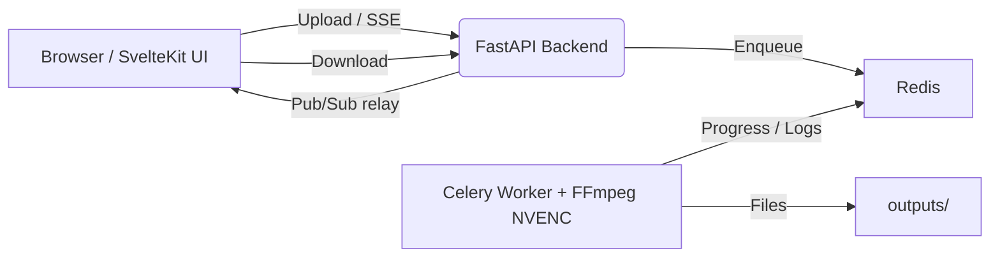

# 8mb.local – Self‑Hosted GPU Video Compressor

8mb.local is a self‑hosted, fire‑and‑forget video compressor. Drop a file, choose a target size (e.g., 8MB, 25MB, 50MB, 100MB), and let GPU-accelerated encoding produce compact outputs with AV1/HEVC/H.264. Supports **NVIDIA NVENC**, **Intel QSV**, **AMD AMF/VAAPI**, and **CPU fallback**. The stack includes a SvelteKit UI, FastAPI backend, Celery worker, Redis broker, and real‑time progress via Server‑Sent Events (SSE).

## Screenshots

<details>
<summary>Screenshots (click to expand)</summary>

<br/>


</details>

## Features
- **Multi-vendor GPU support**: Auto-detects NVIDIA NVENC, Intel QSV, AMD AMF/VAAPI, or falls back to CPU
- Drag‑and‑drop UI with helpful presets and advanced options (codec, container, tune, audio bitrate)
- **Resolution control**: Set max width/height while maintaining aspect ratio
- **Video trimming**: Specify start/end times (seconds or HH:MM:SS format)
- ffprobe analysis on upload for instant estimates and warnings
- Real‑time progress and FFmpeg logs via SSE
- Hardware encoders: AV1, HEVC (H.265), H.264 (GPU-accelerated when available)
- Software fallback: libx264, libx265, libsvtav1 for CPU-only systems
- Output container choice: MP4 or MKV, with compatibility safeguards

## Architecture (technical deep dive)



Components
- Frontend (SvelteKit + Vite): drag‑and‑drop UI, size estimates, SSE progress/logs, final download.
- Backend API (FastAPI): accepts uploads, runs ffprobe, relays SSE, and serves downloads.
- Worker (Celery + FFmpeg 7.x): executes compression with auto-detected hardware acceleration (NVENC/QSV/AMF/VAAPI/CPU); parses `ffmpeg -progress` and publishes updates.
- Redis (broker + pub/sub): Celery broker and transport for progress/log events.

Data & files
- `uploads/` – incoming files
- `outputs/` – compressed results
- The backend periodically deletes old files after `FILE_RETENTION_HOURS`.

## Configuration (env)
- `AUTH_ENABLED` (true|false)
- `AUTH_USER`, `AUTH_PASS`
- `FILE_RETENTION_HOURS` (default 1)
- `REDIS_URL` (defaults to the compose redis service)
- `PUBLIC_BACKEND_URL` for the frontend (defaults to `http://localhost:8000`)

Example `.env` (copy from `.env.example`):

```
AUTH_ENABLED=false
AUTH_USER=admin
AUTH_PASS=changeme
FILE_RETENTION_HOURS=1
REDIS_URL=redis://redis-broker:6379/0
BACKEND_HOST=0.0.0.0
BACKEND_PORT=8000
```

## Using the app
1. Drag & drop a video or Choose File.
2. Pick a target size or enter a custom MB value, click Analyze (auto‑analyzes on drop).
3. Optional: open Advanced Options.
   - Video Codec: AV1 (best quality on newer RTX), HEVC (H.265), or H.264 (compatibility).
   - Audio Codec: Opus (default) or AAC. MP4 will auto‑fallback to AAC when Opus is chosen.
   - Speed/Quality: NVENC P1 (fast) … P7 (best). Default P6.
   - Container: MP4 (most compatible) or MKV (best with Opus).
   - Tune: Best Quality (HQ), Low Latency, Ultra‑Low Latency, or Lossless.
4. Click Compress and watch progress/logs. Download when done.

Codec/container notes
- MP4 + Opus isn’t widely supported. If MP4+Opus is selected, the worker automatically uses AAC to preserve compatibility. MKV supports Opus directly.
- MP4 outputs include `+faststart` for better web playback.
- H.264/HEVC outputs are set to a compatible pixel format (yuv420p) and profiles.

Performance tips
- For very small targets, prefer AV1/HEVC and keep audio around 96–128 kbps.
- If speed matters, try Low/Ultra‑Low latency tunes with a faster preset (P1–P4). For best quality, use HQ with P6/P7.

## GPU support tips

### Hardware Acceleration Support
8mb.local automatically detects and uses available hardware acceleration:

- **NVIDIA GPU (NVENC)**: Best support for AV1, HEVC, H.264
  - Windows: Docker Desktop + WSL2 with GPU enabled; install NVIDIA drivers and Container Toolkit in WSL2
  - Linux: Install NVIDIA drivers and NVIDIA Container Toolkit
  - Check: `docker exec 8mblocal-worker bash -lc "ffmpeg -hide_banner -encoders | grep -i nvenc"`

- **Intel GPU (Quick Sync Video - QSV)**: Good support for H.264, HEVC, AV1 (Arc GPUs)
  - Requires Intel GPU with QSV support (most 6th gen+ Core CPUs and Arc GPUs)
  - Linux: Ensure `/dev/dri` is accessible in container
  - Check: `docker exec 8mblocal-worker bash -lc "ffmpeg -hide_banner -encoders | grep -i qsv"`

- **AMD GPU (AMF/VAAPI)**: Support for H.264, HEVC, AV1
  - Windows: AMD AMF (hardware-accelerated encoding)
  - Linux: VAAPI (requires Mesa drivers and `/dev/dri` access)
  - Check: `docker exec 8mblocal-worker bash -lc "ffmpeg -hide_banner -encoders | grep -E 'amf|vaapi'"`

- **CPU Fallback**: Works on any system without GPU
  - Uses libx264 (H.264), libx265 (HEVC), libsvtav1 (AV1)
  - Slower but universal compatibility

The system will automatically select the best available encoder at runtime. You'll see a log message like "Hardware: NVIDIA acceleration detected" when compression starts.

## Installation
Run with prebuilt images (recommended) or build locally.

### Option 1: Single Container (Simplest - Recommended)
Run everything in ONE container with embedded Redis:

```bash
docker run -d \
  -p 8000:8000 \
  -v ./uploads:/app/uploads \
  -v ./outputs:/app/outputs \
  --gpus all \
  --name 8mblocal \
  jms1717/8mblocal:single-container
```

Or with docker-compose:
```bash
docker compose -f docker-compose.single.yml up -d
```

Access at: http://localhost:8000

**What's included**: Redis + Backend + Worker + Frontend in a single container managed by supervisord.

### Option 2: Multi-Container (Original)
Run with separate containers for each service:

```bash
docker compose -f docker-compose.multi.yml up -d
```

Frontend: http://localhost:5173  •  Backend: http://localhost:8000

**Note**: GPU acceleration is optional. The system auto-detects available hardware (NVIDIA/Intel/AMD/CPU) and adapts accordingly.

### Build locally
#### Single container:
```bash
docker compose -f docker-compose.single-build.yml build
docker compose -f docker-compose.single-build.yml up -d
```

#### Multi-container:
1. Copy `.env.example` to `.env` and adjust values.
2. Ensure folders: `uploads/`, `outputs/` (mounted into containers).
3. Start services (first run: worker compiles FFmpeg, takes longer):

```bash
docker compose -f docker-compose.multi-build.yml up --build -d
```

### Update to latest images

**Single container:**
```bash
docker pull jms1717/8mblocal:single-container
docker compose -f docker-compose.single.yml up -d
```

**Multi-container:**
```bash
docker compose -f docker-compose.multi.yml pull
docker compose -f docker-compose.multi.yml up -d
```

### Troubleshooting
- No hardware acceleration: System will fall back to CPU encoding. Check Docker logs for "Hardware: CPU acceleration detected"
- NVENC not available: Confirm NVIDIA drivers and Container Toolkit are installed; try restarting Docker
- Intel QSV not working: Ensure `/dev/dri` device is accessible and Intel GPU drivers are installed
- AMD encoding issues: Check for Mesa drivers (Linux) or recent AMD drivers (Windows)
- Permission denied writing uploads/outputs: ensure your OS user owns the repo folders or adjust volume permissions
- Ports in use: change `5173`/`8000` mappings in compose
- No progress events: ensure the frontend can reach `http://localhost:8000` directly (SSE shouldn't be buffered by a proxy)

## Maintainers
- Images are built and published from CI on pushes to `main`. See `docs/DOCKER_HUB.md` for maintainer‑focused publishing steps.

## Notes
- Hardware acceleration is automatically detected and used when available (NVIDIA/Intel/AMD)
- AV1 support varies by hardware: NVIDIA (RTX 40-series+), Intel (Arc GPUs), AMD (RDNA 3+), or CPU fallback
- MP4 + Opus is not supported; the worker auto‑encodes AAC in MP4
- Consider HTTPS termination and stronger auth for public deployments
